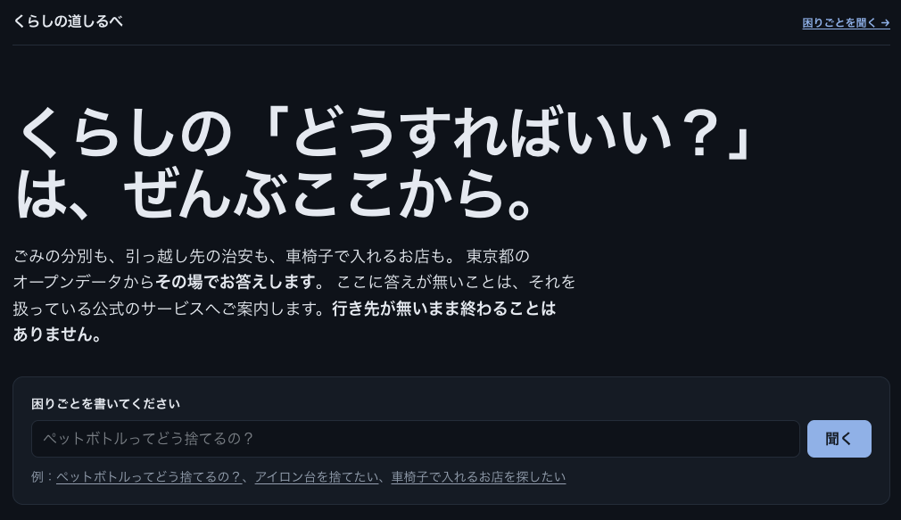
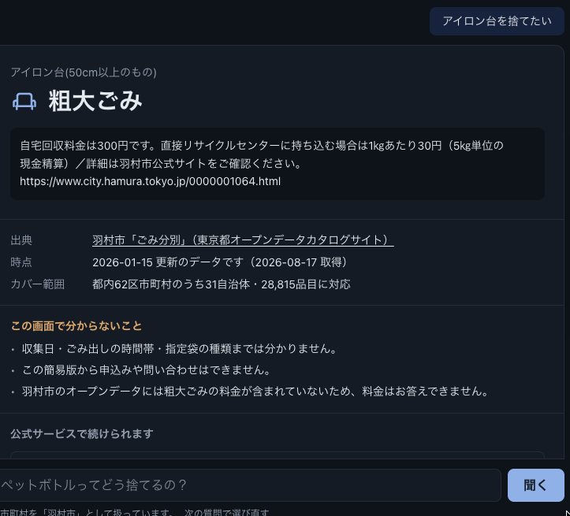
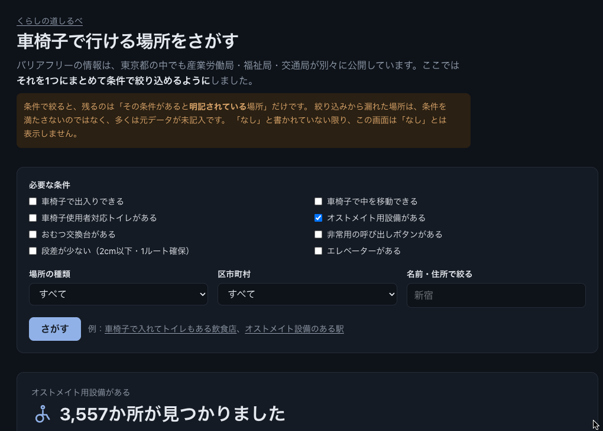
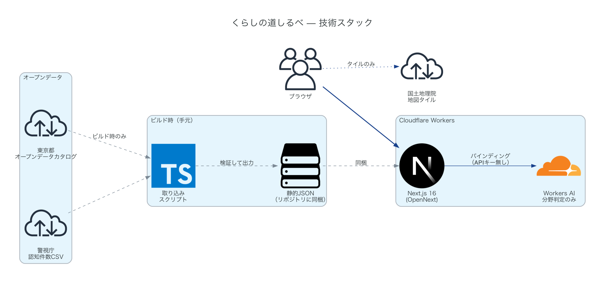

# くらしの道しるべ

くらしの「どうすればいい？」に、東京都のオープンデータからその場で答えを返すポータル。
ここで答えられないことは、**できないことを書いた上で**それを扱っている公式サービスへご案内する。

都知事杯オープンデータ・ハッカソン2026 応募作品。

## できること

| 画面 | 何が分かるか | 規模 |
| :--- | :--- | :--- |
| `/gomi` ごみの分別 | 品目名を入れると、お住まいの自治体の表記のまま分別区分・注意点・粗大ごみの料金が出る | 31自治体・28,815品目 |
| `/bouhan` 町丁ごとの犯罪認知件数 | 2つ入力すると並べて比べられる。前年からの増減と、何の手口でその件数になっているかも出る | 令和7年・5,142町丁 |
| `/manabi` 学びと体験の場 | 図書館・博物館・公民館などを種別をまたいで1つの地図で探せる | 849施設・9種別 |
| `/barrierfree` 車椅子で行ける場所 | 必要な設備を選ぶと、飲食店・鉄道駅・公共施設を横断で絞り込める | 3局・6,278か所 |

## 使い方

**入口は2つある。** どちらを通っても、返ってくる答えの形は同じ。

### 1. 言葉で聞く — `/chat`

思いついたままの言葉で書く。「アイロン台を捨てたい」「西新宿７丁目の治安が知りたい」「車椅子で入れるお店を探したい」。
AIはどの画面で答えるかを決めるだけで、答えの本文には関わらない。

ごみの分別は自治体ごとに違うので、**区市町村が分からないときは推測せずに聞き返す。**
一度答えた区市町村は端末に覚えて、次からは聞き返さない（`localStorage`。サーバには送らない）。

### 2. 条件で絞る — 4つの画面

分野が決まっているなら直接いく方が速い。`/gomi` `/bouhan` `/manabi` `/barrierfree`。

`/barrierfree` は必要な設備を選ぶと、飲食店・鉄道駅・公共施設を局をまたいで絞り込む。
結果は一覧と地図の両方で見られる。`/bouhan` は町丁を2つ入れると並べて比べられる。

> **条件で絞ると、残るのは「その設備があると明記されている場所」だけ。**
> 絞り込みから漏れた場所は、設備が無いのではなく、多くは元データが未記入。
> 「なし」と書かれていない限り、この画面は「なし」とは表示しない。

### 答えられないとき

**「無い」と断定しない。** 載っていない品目、未対応の区市町村、そもそも扱っていない分野——
どれも**なぜ答えられないのかを書いた上で**、それを扱っている公式サービスへ案内する。

## 何が違うのか

よくあるAIチャット（資料を検索してAIに要約させる作り）とは、答えの出どころが違う。

- **答えの本文は行政のオープンデータそのもの。** 生成AIは分野の判定とパラメータ抽出しかしない。文章を書かせない
- **ご案内するURLは、人が確認した一覧の中からしか選べない。** AIが生成したURLは表示しない
- **出典・時点・カバー範囲・この画面でできないこと・公式への出口は、型で必須にしてある。** 書き忘れた画面はコンパイルが通らない
- **申請・予約・申込みは代行しない。** 住民に責任が生じる行為は必ず公式の窓口へ送る
- **AIが止まってもキーワード判定に切り替えて動き続ける。** どちらの経路で答えたかは毎回画面に出す

## 構成

Cloudflare Workers 1つで動く。**APIキーも外部DBも持たない。**

| | |
| :--- | :--- |
| アプリ | Next.js 16（App Router）→ `@opennextjs/cloudflare` で Cloudflare Workers へ |
| AI | Cloudflare Workers AI の function calling（`AI` バインディング。**鍵の受け渡しが無い**） |
| データ | 取り込み済みの静的JSONをリポジトリに同梱。実行時に行政のサーバを叩かない |
| 地図 | MapLibre GL JS ＋ 国土地理院タイル（登録不要） |

**破線はビルド時、実線は実行時。** 行政のサーバへ伸びる線が実行時に1本も無いことがこの図の要点で、
当日に外部の都合で止まる部品を構成の側から1つずつ外した結果こうなっている。

図は [`docs/architecture.py`](docs/architecture.py) から生成している（`diagrams` ＋ graphviz）。

## 出典

- 東京都オープンデータカタログサイト（各区市町村のごみ分別、東京都教育庁 施設関連情報、産業労働局・福祉局・交通局のバリアフリー情報）
- 警視庁「区市町村の町丁別、罪種別及び手口別認知件数（年累計）」
- 地図タイル：[国土地理院](https://maps.gsi.go.jp/development/ichiran.html)
